- 

|                                | loss                                                         |                            sharp                             |
| ------------------------------ | ------------------------------------------------------------ | :----------------------------------------------------------: |
| 13-17，18，19                  |  | 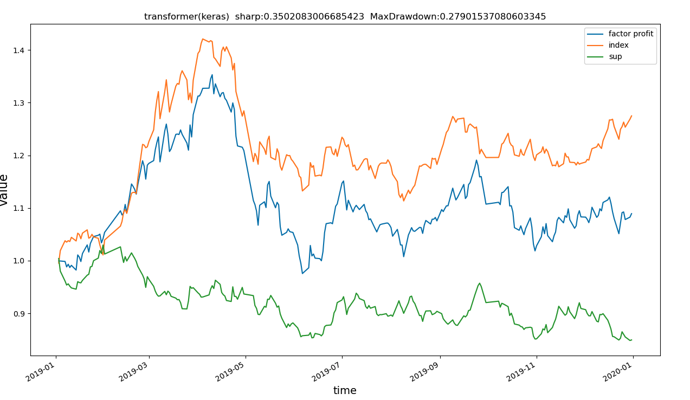 |
| 13-18，19                      | 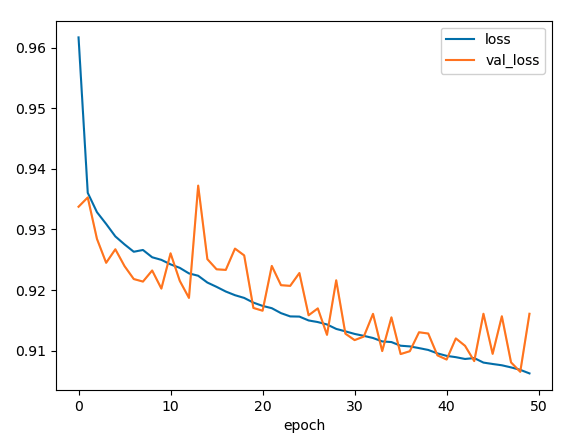 | 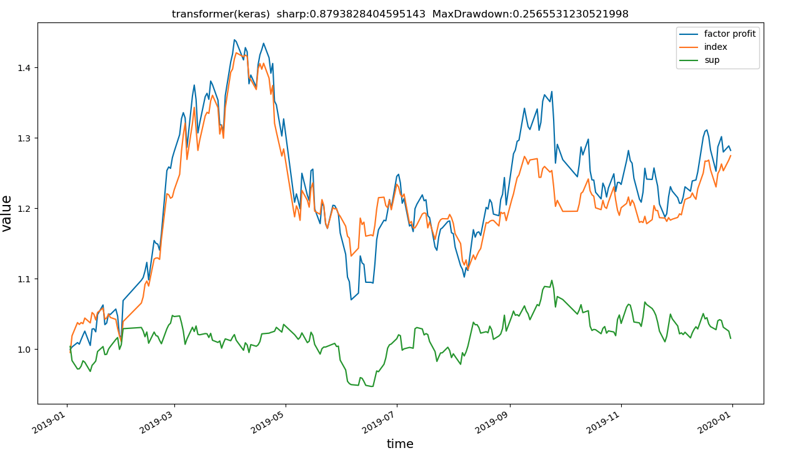 |
| 样本权重1，4，1                |  | 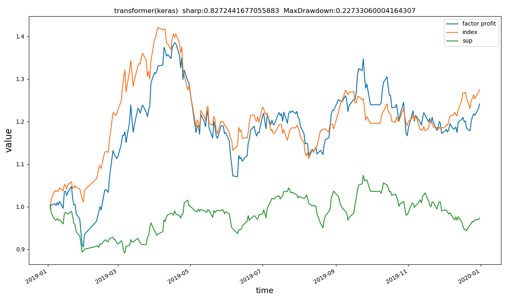 |
| 样本权重1，2，2                | 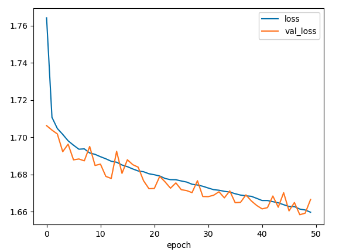 |  |
| seed-42，transformer           | 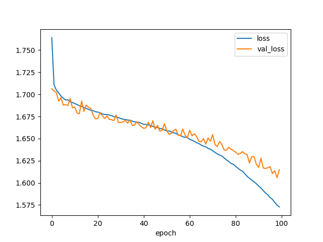                                       | 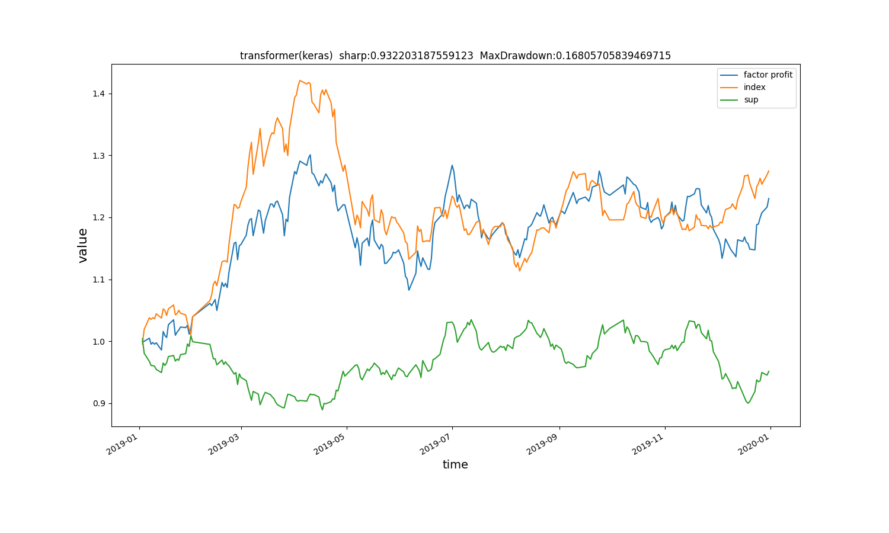 |
| seed-42，base                  | 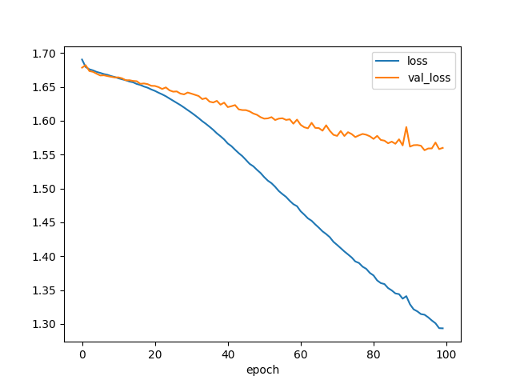                             |                    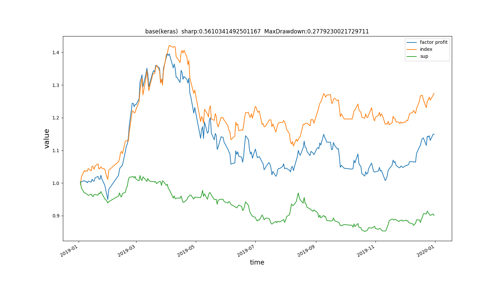                    |
| seed-43，transformer           | 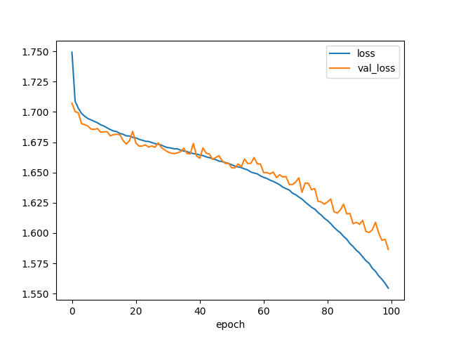                               | 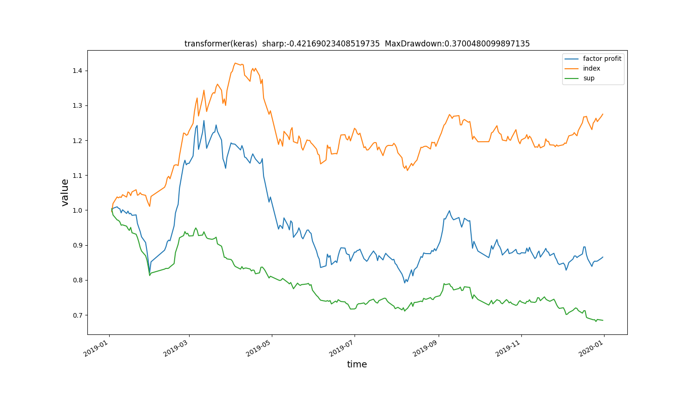 |
| seed-43，base                  | 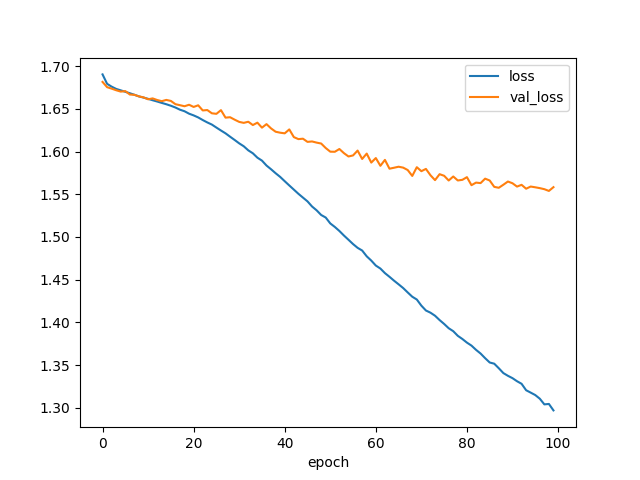                               | 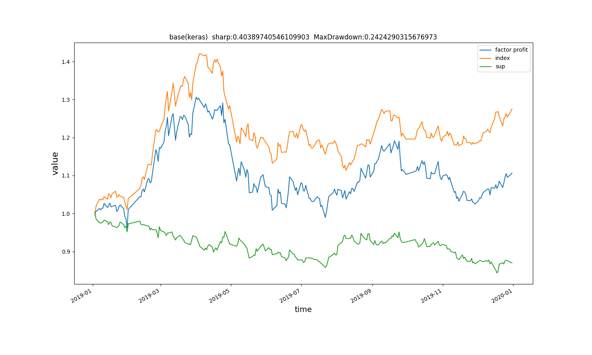 |
| seed-42，加入高斯偏差          |  |  |
| seed-42，使用ReduceLROnPlateau |  |  |
|                                |                                                              |                                                              |
|                                |                                                              |                                                              |

- 在尝试结构

  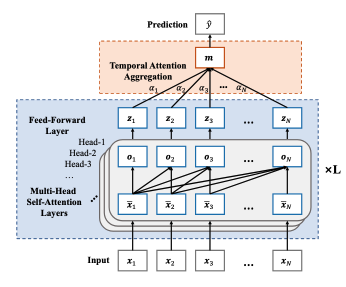

  

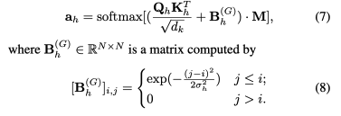

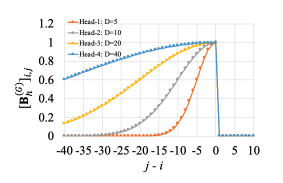

​                                               不同的高斯偏差使得对应的注意力头更加关注近期的信息

