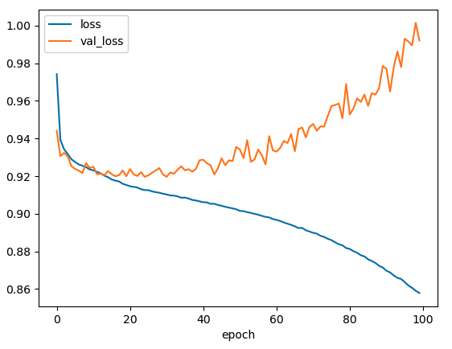
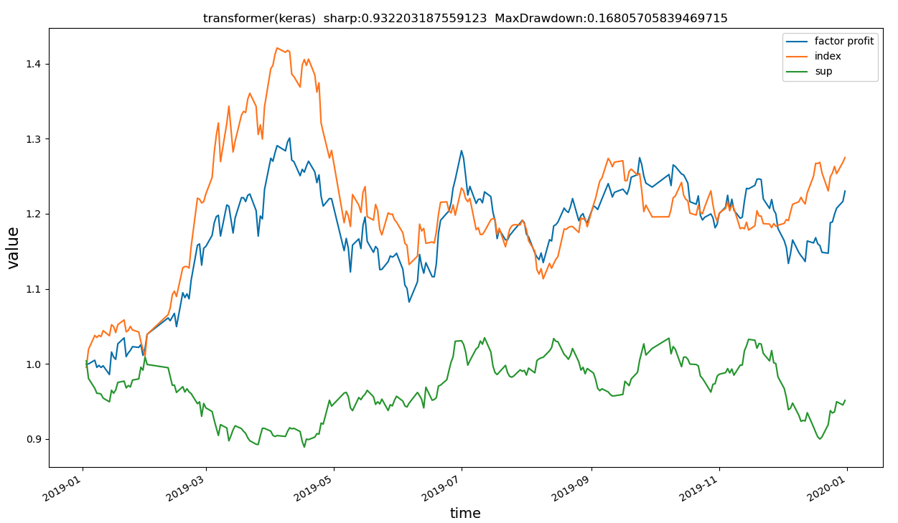

- 

|                                | loss                                                         |                            sharp                             |
| ------------------------------ | ------------------------------------------------------------ | :----------------------------------------------------------: |
| 13-17，18，19                  |  |  |
| 13-18，19                      |  |  |
| 样本权重1，4，1                |  |  |
| 样本权重1，2，2                |  |  |
| seed-42，transformer           |                                        |  |
| seed-42，base                  |                              |                                        |
| seed-43，transformer           |                                |  |
| seed-43，base                  |                                |  |
| seed-42，加入高斯偏差          |  |  |
| seed-42，使用ReduceLROnPlateau |  |  |
|                                |                                                              |                                                              |
|                                |                                                              |                                                              |

- 在尝试结构

  

  

​                                               不同的高斯偏差使得对应的注意力头更加关注近期的信息

称为前一百的概率越大，股票就越好吗？

## 交叉验证方法

- 深度学习的交叉验证

| 测试集 | loss | sharp                                                        | base_sharp                                                   |
| :----- | ---- | ------------------------------------------------------------ | ------------------------------------------------------------ |
| 18年   |      |  |  |
| 19年   |      |  |  |
| 20     |      |  |  |
| 21年   |      |  |  |

band attention

持有天数25

持股数25

不加权重，选择sharp

加权重，选择sharp

